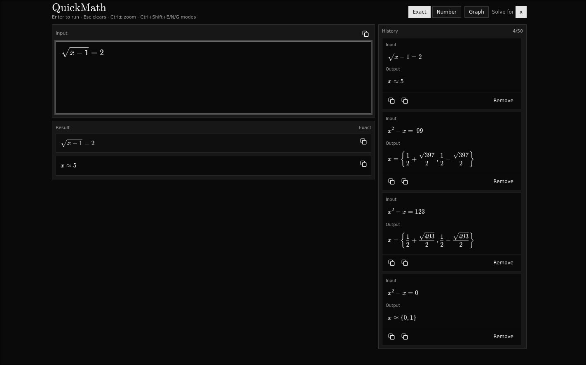

# QuickMath

A scientific calculator built with Electron, React, Vite, and Tailwind CSS, for fast calculations and graphing.

- uses [MathLive](https://cortexjs.io/mathlive/) for the LaTeX text field.

## Features
- Keyboard-first workflow: `Enter` evaluates, `Esc` clears, `Ctrl±` zooms input text, `Ctrl/Cmd+Shift+E/N/G` toggles Exact/Number/Graph.
- LaTeX math input via MathLive (supports most common functions/operators supported by the Compute Engine).
- Exact and numeric output modes.
- Equation solving (single-variable). Falls back to numeric root finding when symbolic solving can’t find solutions.
- Quick graphing
- Result + history: recent inputs/outputs are saved locally; click a history item to reuse it.
- One-click copy buttons for input/output LaTeX in the input, result, and history panels.
